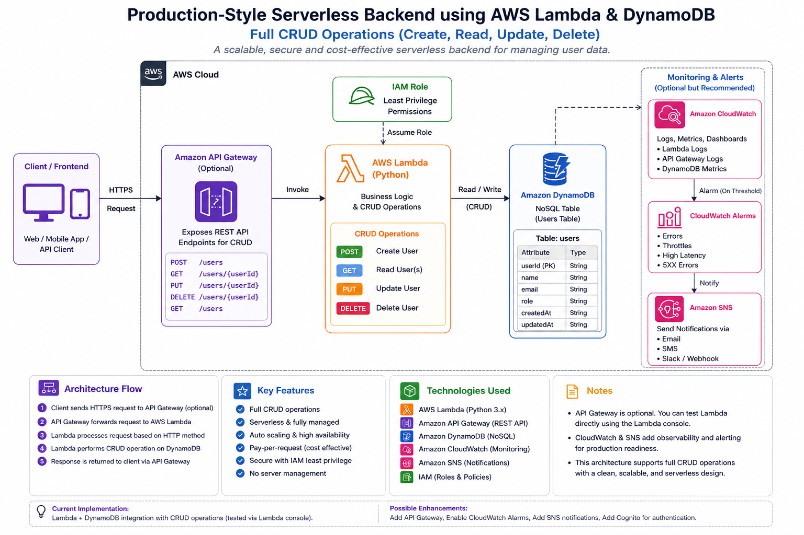

# Production-Style Serverless Backend using AWS Lambda & DynamoDB

A production-style serverless backend architecture built using AWS Lambda, Amazon DynamoDB, API Gateway, Python, and Boto3 to understand modern cloud-native CRUD workflows through hands-on implementation.

---

# Project Overview

This project demonstrates how modern serverless backend systems are designed using AWS managed services.

The architecture follows a cloud-native event-driven workflow where backend logic executes dynamically through AWS Lambda instead of running continuously on traditional backend servers.

The backend is designed to support CRUD operations:

* Create
* Read
* Update
* Delete

using:

* API Gateway
* AWS Lambda
* Amazon DynamoDB
* IAM
* CloudWatch
* SNS

This project is part of my AWS Cloud & DevOps project-based learning journey focused on understanding production-style cloud architectures through practical implementation.

---

# Architecture Diagram



---

# Architecture Workflow

```text id="d1nd0t"
Frontend/User Request
        ↓
Amazon API Gateway
        ↓
AWS Lambda Function
        ↓
Amazon DynamoDB
```

---

# Request Flow

```text id="lxnll0"
Client Request
      ↓
API Gateway
      ↓
AWS Lambda
      ↓
DynamoDB
      ↓
Lambda Response
      ↓
API Gateway Response
      ↓
Client
```

---

# Traditional Backend vs Serverless Backend

| Traditional Backend                   | Serverless Backend                   |
| ------------------------------------- | ------------------------------------ |
| Requires continuously running servers | Backend executes only when triggered |
| Manual scaling                        | Automatic scaling                    |
| Infrastructure management required    | Fully managed by AWS                 |
| Higher operational overhead           | Reduced operational complexity       |
| Pay for server uptime                 | Pay only for execution time          |

---

# AWS Services Used

| AWS Service        | Purpose                            |
| ------------------ | ---------------------------------- |
| AWS Lambda         | Serverless backend compute         |
| Amazon DynamoDB    | NoSQL database storage             |
| Amazon API Gateway | API routing and request handling   |
| AWS IAM            | Secure permissions management      |
| Amazon CloudWatch  | Monitoring and Lambda logs         |
| Amazon SNS         | Monitoring alert workflow concepts |
| Python + Boto3     | Backend logic and AWS SDK          |

---

# Key Concepts Implemented

## Serverless Backend Architecture

Understood how backend applications can run without managing traditional backend servers.

---

## API Gateway Routing

Learned how API Gateway receives HTTP requests and routes them to AWS Lambda.

---

## Single Lambda Handling Multiple CRUD Operations

A single Lambda function handles all CRUD operations internally using HTTP methods.

```text id="r4by9l"
POST   → Create
GET    → Read
PUT    → Update
DELETE → Delete
```

API Gateway routes all requests to the same Lambda function, and the Lambda function separates operations internally using:

```python id="6bsmto"
event['httpMethod']
```

---

## DynamoDB Integration

Integrated AWS Lambda with DynamoDB using Boto3 for NoSQL CRUD operations.

---

## IAM-Based Security

Used IAM execution roles to securely allow Lambda to interact with DynamoDB.

---

## Monitoring & Observability

Understood how:

* CloudWatch stores Lambda execution logs
* SNS can be integrated with CloudWatch alarms for monitoring workflows

---

# CRUD Workflow

## Create User

Insert new user data into DynamoDB.

```python id="i1eh7f"
table.put_item()
```

---

## Read User

Retrieve existing user data.

```python id="r2bww9"
table.get_item()
```

---

## Update User

Modify existing user information.

```python id="zq2ty8"
table.update_item()
```

---

## Delete User

Remove user records from DynamoDB.

```python id="4v13oe"
table.delete_item()
```

---

# Lambda CRUD Backend Code

The backend logic is implemented using a single AWS Lambda function written in Python.

The function dynamically processes CRUD operations based on the HTTP request method received from API Gateway.

---

# Project Folder Structure

```text id="1s6g4l"
production-style-serverless-backend-lambda-dynamodb/
│
├── README.md
│
├── architecture/
│   ├── README.md
│   └── Archh1.png
│
├── screenshots/
│   ├── README.md
│   ├── Screenshot 1 — DynamoDB Table Created(1).png
│   ├── Screenshot 2 — Lambda Function Overview(1).png
│   ├── Screenshot 3 — Lambda Test Success(1).png
│   └── Screenshot 4 — Item Visible in DynamoDB(1).png
│
├── src/
│   ├── README.md
│   └── lambda_function.py
│
├── sample-data/
│   ├── README.md
│   ├── create-user-request.json
│   ├── update-user-request.json
│   └── sample-dynamodb-item.json
│
└── docs/
    ├── README.md
    ├── project-overview.md
    ├── learning-outcomes.md
    ├── challenges-faced.md
    ├── future-improvements.md
    └── project-presentation.pdf
```

---

# Screenshots

## DynamoDB Table Created

.png)

---

## Lambda Function Overview

.png)

---

## Lambda Test Success

.png)

---

## Item Visible in DynamoDB

.png)

---

# Challenges Faced

## IAM Permission Errors

Initially faced permission-related issues while allowing Lambda to access DynamoDB securely.

### Resolution

Configured proper IAM execution role permissions.

---

## Understanding API Gateway Routing

Required deeper understanding of how API Gateway forwards requests to Lambda functions.

### Resolution

Studied API request flow and serverless backend architecture patterns.

---

## CRUD Routing Logic

Initially confusing how one Lambda function handles multiple operations.

### Resolution

Understood that Lambda separates CRUD workflows internally using:

```python id="xfyvgv"
event['httpMethod']
```

---

# Important Learning Outcome

One of the biggest learnings from this project was understanding the difference between:

## Traditional Backend Architecture

```text id="v5awry"
Frontend
   ↓
Backend Server
   ↓
Database
```

and

## Modern Serverless Architecture

```text id="ok2sbq"
S3 + CloudFront
        ↓
API Gateway
        ↓
Lambda
        ↓
DynamoDB
```

This project helped bridge the gap between traditional backend systems and modern cloud-native serverless application design.

---

# Future Improvements

Potential future production-level enhancements:

* Full API Gateway deployment
* Cognito JWT authentication
* CloudWatch alarms
* SNS notifications
* Infrastructure as Code using Terraform
* CI/CD pipeline using GitHub Actions
* Frontend integration using S3 + CloudFront
* Separate Lambda functions for each CRUD operation
* Advanced request validation
* Multi-environment deployment

---

# Documentation

Detailed project explanations are available inside the `docs/` folder.

The documentation includes:

* project overview
* architecture explanation
* concepts learned
* challenges faced
* future improvements
* project presentation PDF

---

# Final Outcome

Successfully built a production-style serverless backend learning project demonstrating:

* API Gateway routing concepts
* Lambda-based backend execution
* DynamoDB CRUD integration
* IAM-based security
* Event-driven architecture
* Cloud-native backend workflow understanding

This project represents one step in my long-term AWS Cloud & DevOps project-based learning journey.

---

# Connect With Me

## LinkedIn

[www.linkedin.com/in/adhithyan-sivaraman-t-399b5b362](http://www.linkedin.com/in/adhithyan-sivaraman-t-399b5b362)

## GitHub

https://github.com/Adhithyan-10

---

# AWS Cloud & DevOps Learning Journey

This repository is part of a structured cloud engineering roadmap focused on building practical hands-on AWS projects while documenting architecture concepts, workflows, and implementation learnings.
